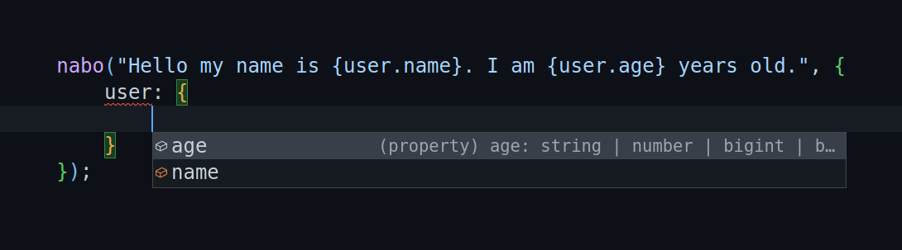

<h1 align="center">nabo</h1>

<h4 align="center">🧵 It's just string interpolation.</h1>

<p align="center">
    
    
</p>

<p align="center">
  <a href="#features">Features</a> •
  <a href="#install">Install</a> •
  <a href="#usage">Usage</a>
</p>



## Features

-   TypeScript inference for string literals
-   Supports nested objects
-   Supports both CJS and ESM
-   No dependencies
-   2 kb in size

## Install

```sh
npm install nabo
```

## Usage

```ts
import { nabo } from "nabo";

nabo(
    `There are {personCount} people.
     The first person is called {firstPerson.name}.
     The second person is called {secondPerson.name}.
    `,
    {
        personCount: "two",
        firstPerson: { name: "John Doe" },
        secondPerson: { name: "Jane Doe" },
    }
);
```
